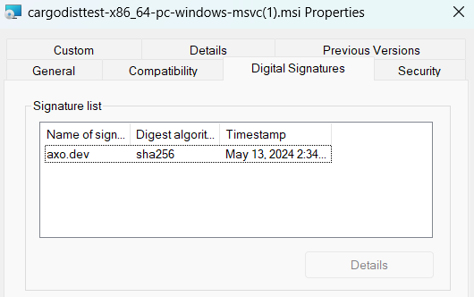

# Windows Artifact Signing with SSL.com Certificates

> since 0.15.0

dist can automatically codesign Windows EXEs and [MSIs](../../installers/msi.md) using SSL.com's [eSigner cloud signing service](https://www.ssl.com/esigner/).

Although there are many ways to do code signing, this process is specifically concerned with ensuring [Windows SmartScreen](https://learn.microsoft.com/en-us/windows/security/operating-system-security/virus-and-threat-protection/microsoft-defender-smartscreen/) recognizes the authenticity of the signatures and doesn't prevent your users from running the application. Otherwise, any user who [downloads your application with a web browser](https://en.wikipedia.org/wiki/Mark_of_the_Web) will get a popup warning them against running it. (Alternative methods of downloading and installing, such as [dist's powershell installers](../../installers/powershell.md) do not trigger SmartScreen.)

Windows code signing is done using essentially the same certificate infrastructure as HTTPS, just with stricter requirements on issuance and management of the private keys. In principle this means you can go to your favourite SSL/TLS Certificate vendor and ask for an EV Code Signing Certificate and follow the same process regardless of which vendor you picked. **However [as of July 2023](https://knowledge.digicert.com/alerts/code-signing-changes-in-2023), all the relevant kinds of code signing certificates can only be issued via hardware security modules (HSMs) like Yubikeys.** This poses a significant challenge for CI/CD pipelines, because you can't just plug a USB key into GitHub CI.

Although this will hopefully improve in the future, for now this has resulted in a fragmented system where each certificate vendor has its own cloud signing service where they host the HSMs and you send them the things you want signed. As a result it's no longer possible to provide a reasonable *generic* Windows code signing workflow, so for now we've made ours specific to one vendor: [SSL.com](https://www.ssl.com/).

Want support for another vendor? [Drop us a line](mailto:hello@axo.dev) or [file an issue](https://github.com/axodotdev/cargo-dist/issues).


## Quickstart

### Part 1: Create an SSL.com certificate (real or sandbox)

1. **Make an account and order your certificate**

    Go to https://ssl.com/ (or https://sandbox.ssl.com for the testing sandbox) and log into your account. Then go to "Dashboard > developer tools", and order "ESIGNER EV CODE SIGNING (360)".

    If you are using a sandbox account, you may need to email support several times to have your test certificate validated *and* issued. The resulting certificate and signatures won't be trusted by Windows, but you can at least test things before buying a certificate.

2. **Enroll in eSigner Cloud Signing**

    Go to "Orders > documents > certificate details": You should see a prompt to a enter and confirm a PIN to setup an OTP login.

    **BE SURE TO SAVE THE TOTP SECRET CODE THAT APPEARS UNDER THE QR CODE FOR YOUR OTP APP, YOUR CI WILL NEED THIS.**

    

3. **Get your credential ID**

    On the same page as the previous step open "signing credentials" and copy the "eSigner credential ID". The credential ID will be used in CI to identify which certificate to use.

    

4. **(optional) Disable malware blocker**

    In the same "signing credentials" section as the previous step, you may want to disable the "malware blocker".

    SSL.com's cloud signing provides an [optional malware checking service](https://www.ssl.com/guide/how-to-use-pre-signing-malware-scan-with-ssl-com-esigner/) which you may want to disable in your account settings. The purpose of this feature is to mitigate the risk of your infrastructure being compromised and being used to sign malware, by essentially giving SSL.com permission to refuse to sign suspicious-looking binaries.

    When publishing from environments like GitHub CI, there isn't much room for such a compromise to occur that wouldn't just compromise your SSL.com account anyway, so the benefits are unclear compared to the risk of your releases randomly failing due to a false positive.

5. **Add [GitHub Secrets](https://docs.github.com/en/actions/security-guides/encrypted-secrets) to your repository**

    - `SSLDOTCOM_USERNAME`: the username of your ssl.com account
    - `SSLDOTCOM_PASSWORD`: the password to your ssl.com account
    - `SSLDOTCOM_TOTP_SECRET`: this is the totp "secret code" from Step 2
    - `SSLDOTCOM_CREDENTIAL_ID`: this is the "credential id" from Step 3

    For reference, the [SSL.com documentation for their official GitHub Action](https://www.ssl.com/how-to/cloud-code-signing-integration-with-github-actions/) uses the names: ES_USERNAME, ES_PASSWORD, ES_TOTP_SECRET, and CREDENTIAL_ID for these values. The “ES” stands for “esign”. We renamed these variables to make them more specific and clear.


### Part 2: Enable SSL.com signing with dist

1. **Configure dist to codesign**

    Add the following to your `Cargo.toml` or `dist.toml`:

    ```toml
    [workspace.metadata.dist]
    ssldotcom-windows-sign = "prod"  # or "test" if you are using a sandbox account
    ```


2. **Run `dist init` on your project**

    You've already fully configured the feature, we're just ensuring your config changes are applied and checked.


3. **You're done!**

    The simplest way to test your signing out is to cut a (pre)release, but [you can also build the artifacts in a pull request](https://opensource.axo.dev/cargo-dist/book/ci/github.html#build-and-upload-artifacts-on-every-pull-request).

    If everything worked, all windows binaries and MSIs should now be signed with your certificate. If you used real certificates, you can test this by downloading the windows .zip for your app with your browser and double-clicking it in your file explorer. If you get no message that "Windows protected your PC", it worked!

    If you used a sandbox (test) certificate, SmartScreen won't acknowledge the code signing at all, but you should be able to see a "Digital Signatures" entry in the properties of the file:

    
