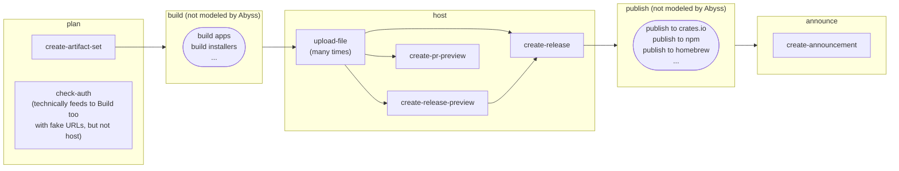

# gazenot

*Gaze Not Into The Abyss, Lest You Become A Release Engineer*

Gazenot is a client library for accessing Abyss, the heart of [axo Releases](https://releases.axo.dev).

## axo Releases: An Explainer

Abyss is easiest to understand as a simple package registry for prebuilt binaries.

### Goals

There are several objectives to its design:

* It should be easy to "partially" run a "publish" to let end-users test their release process (via cargo-dist's
  pull-request CI)
* It should be easy to "rollback" a release that failed part way through the process (e.g. because `npm publish` failed)
* Once a release is *really* complete ("Announced") it should become immutable-by-default
* Make Something Better Than GitHub Releases
* Something Something Software-Bill-Of-Materials Features

### Core Concepts

Abyss defines the following core concepts:

* A **Package** is a collection of ArtifactSets, Releases, and Announcements. It generally is 1:1 with things like A
  Cargo Package. Typically a Package will be "An Application" (potentially with multiple binaries), but it can also be "
  A Library" (in which case it mostly exists to host changelogs/announcements/source-tarballs). Packages belong to an
  Owner.
* An **ArtifactSet** is essentially a directory of files associated with a Package. It is created with no contents and a
  permanent randomly generated Set URL. Files can be incrementally uploaded to it freely until it is "upgraded" to a
  Release-Like, at which point mutation should not (by default) be allowed. If an ArtifactSet isn't "upgraded" then it's
  Orphaned and eligible for garbage collection (after Many days).
* There are 3 **Release-Likes** (although only the first is currently defined). Once created, a Release-Like "seals" the
  ArtifactSet to modifications and it gets a better Artifact Download URL.
    * A **Release** is (a layer on top of) an ArtifactSet with a Version and Tag. Creating a Release creates A Release
      URL. Once initially created, a Release is still "disconnected" from the actual list of releases the package has,
      for the purposes of requests like "list all releases" or "announce all releases". See The Pipeline for why this is
      significant.
    * (Theoretically) A **Release Preview** is a faux-Release that gets a Release Preview URL (as opposed to a proper
      Release URL), allowing the Release's contents to be inspected at the user's leisure. It should in principle be
      possible to "upgrade" to a real Release later, avoiding rebuilds/delays once the user is ready to Announce.
      Unclear what's in scope for this.
    * (Theoretically) A **PR Preview** is a more minimal Release Preview (Presumably with a PR Preview URL) for testing
      out pull-requests (like Vercel). Conceptually this would be something like "host a webpage with a docker image for
      the linux build".
* An **Announcement** is (a layer on top of) several Releases that should be made "truly live" with a markdown body.
  Creating an Announcement for a Release makes it show up in "list all releases" and "what's the latest release"
  queries. Notably this can modify the Latest Release URL. Theoretically this could also trigger things like "send
  notification emails" (A Github Releases feature) and "post to social media", but some of those might be "things
  cargo-dist does" and not "things Abyss does/triggers".

And these less-core-but-still-fundamental concepts:

* An **Owner** (e.g. "axodotdev") is a user (or organization) of a SourceHost that owns the Package's repository (this
  is largely managed by Sunfish, we just faithfully record the things it tells us about ownership/authentication)
* A **SourceHost** (e.g. "github") is the hosting (repository) provider for the source code of a Package

### The Pipeline

cargo-dist defines a pipeline for releasing/announcing a package, which Abyss heavily models. The cargo-dist pipeline
is:

* **Plan**: determine how we're hosting / if hosting works
* **Build**: build binaries/installers
* **Host**: upload files to hosting (**THAT'S ABYSS BAYBEE!!!**)
* **Publish**: publish to various package managers
* **Announce**: announce the releases

The goal of separating Host, Publish, and Announce into separate steps is to allow us to get stable/pretty Release URLs
live in case they should be used for things like an npm package that fetches from our hosting **while still allowing the
npm publish to fail**. That is, by keeping the release "disconnected" or "permissions: only people with this URL can
view it", we have the ability to still roll back the release without updating things like The Latest Release URL or The
List Of All Releases.

> Note 1: currently cargo-dist always bakes in the more ugly Set URL when generating installer impls, as the design
> of Abyss currently disallows cargo-dist from knowing the Release URL until it actually invokes create-release, even
> though cargo-dist knew it would *want* to from the start. That said, this uglier mode is necessary for Release
> Preview -> Release workflows, so it's good that works!

> Note 2: there is currently no supported functionality for doing this kind of "Release rollback". The user needs to
> manually intervene to throw out a Disconnected Releases, which currently would be like, emailing us. The key point is
> that *conceptually* a Disconnected Release can be totally scrapped (making its Release URL go dead), while an Announced
> Release is ideally As Forever As Possible.

The following diagram depicts how Abyss's concepts map to this pipeline (and which endpoints cargo-dist invokes during
each one).

(Arguably create-release is a "the first publish step" but cargo-dist currently lumps it into "host" and that
increasingly feels correct/simpler *shrug*...)

### Artifact Download URLs

One of the core side-effects of Abyss is Making URLs You Can Download Artifacts From. Because it breaks the release
process into multiple stages, there are many Kinds of Artifact Download URL. These all point to CDN hosting, and
*not* Abyss.

* A **Set Url** (`https://myuser.artifacts.axodotdev.host/myapp/ax_UJl_tKCujZwxKL1n_K7TM`) is a permanent randomly
  generated URL for downloading files from an ArtifactSet. It can be embedded in things like the bodies of curl-sh
  installers made by cargo-dist, but ideally it **should never** be presented to end-users in things like curl-sh
  *expressions* which show up on oranda websites, install widgets, or announcement posts.
* A **Release URL** (`https://myuser.artifacts.axodotdev.host/myapp/v1.0.0/`) is a permanent stable-format URL for
  downloading files from a Release('s ArtifactSet). This is typically what should be presented in curl-sh *expressions*.
  This URL may go dead if a Release is never Announced.
* A **Latest (Release) URL** (`https://myuser.artifacts.axodotdev.host/myapp/latest/`) is a mutable-destination
  stable-format URL for downloading "whatever the latest Release('s ArtifactSet) is". This URL is appropriate for
  linking in random docs which you don't want to update every time there's a release.
* (Theoretically) A **Release Preview URL** ...
* (Theoretically) A **PR Preview URL** ...

## License

Licensed under either of

* Apache License, Version 2.0, ([LICENSE-APACHE](LICENSE-APACHE) or [apache.org/licenses/LICENSE-2.0](https://www.apache.org/licenses/LICENSE-2.0))
* MIT license ([LICENSE-MIT](LICENSE-MIT) or [opensource.org/licenses/MIT](https://opensource.org/licenses/MIT))

at your option.

## Contributions

Unless you explicitly state otherwise, any contribution intentionally
submitted for inclusion in the work by you, as defined in the Apache-2.0
license, shall be dual licensed as above, without any additional terms or
conditions.

If you are interested in contributing, please read our [CONTRIBUTING notes] and our [Code of Conduct].
